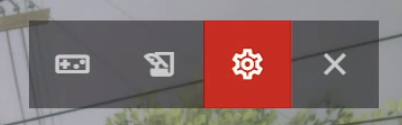
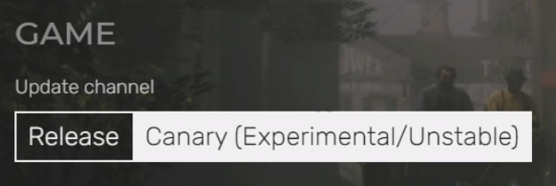

# Running the RedM client to ‘play the game’

* Installing RedM will take a while depending on your internet connection speed.
* Red Dead Redemption 2 is about 120 gigabytes ~ 2 hours.
* While installing RedM you will download approximately 8 gigabyte of additional data ~ an hour
* During this time you will have to create a Cfx.re account ~ 10 minutes

## Install Red Dead Redemption 2

You are going to need the **full version** of *Red Dead Redemption 2*. Buying and installing *Red Dead Online* is **not** going to work.

Make sure the game start and works before proceeding. When launching *RedM* you will always need to have the *Rockstar Games Launcher* running, probably because it handles Digital Rights Management nonsense.

## Install RedM

1. Go to [https://redm.net](https://redm.net)
2. Download the RedM installer by clicking the *now* link
3. Run the downloaded exe and follow instructions

Downloading all resources is going to take a while. This step uses the peer-to-peer protocol IPFS to download files and that's dependent on the number of online users.

This is a good time to create a Cfx.re account.

## Create a Cfx.re account

RedM uses their own account system to identify players. The account can be used for whilelisting and blacklisting on servers.

1. Go to [https://forum.cfx.re](https://forum.cfx.re)
2. Create an account
3. Verify your e-mail address

## Link your Cfx.re account

Once RedM is done installing you should be able to start RedM. It will warn you when the *Rockstar Games Launcher* isn't running.

1. Follow instructions to link your Cfx.re account with RedM.

## Configure RedM

You just installed the stable version of RedM. There is also an experimental version that you can enable in the settings. Click the cogwheel in the top-right to change this.

Depending on the server version you will need either the stable or canary version. Currently (summer 2021) you will probably need the unstable canary version.

After switching to the canary update channel you will have to download a few more resources, this shouldn't take too long.

1. Choose the correct *Update Channel*

## Select a server and play

> Note that a lot of servers require you to apply for an account. The server description will probably explain this.

### Connect to an advertised server

1. Hit the big play button with your username in it
2. Wait for servers to start loading in
3. Use the input field to filter servers, it has instructions when you start typing
4. Click a server and then connect

### Connect to a private server

When the server is unlisted you will have to enter the IPv4 address of the server (ie. IPv6 is not supported).

1. Hit the big play button with your username in it
2. Use the input field to enter an IP address, for example `196.189.1.38`
3. **If** RedM can reach the server in this way, it will now show server details after a few moments
4. Click connect

> Connecting to an unlisted server may be a bit rough. It's probably easier configure the server to advertise itself to Cfx.re and turn on whitelisting.